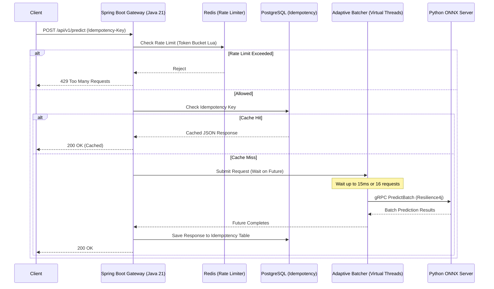

# ML Inference Gateway


An enterprise-grade, high-concurrency Machine Learning inference gateway built with **Spring Boot 3 (Java 21)** and **Python**.

This architecture safely bridges highly scalable, I/O-bound REST APIs with strictly compute-bound Machine Learning models using **Adaptive Micro-Batching**, **gRPC**, and **Virtual Threads**.

## Key Features

*   **Adaptive Micro-Batching:** Spring Boot leverages Java 21 Virtual Threads and a concurrent `BlockingQueue` to intelligently group single incoming REST requests into micro-batches (e.g., 16 requests at a time, or up to 15ms wait). This maximizes the GPU/CPU throughput of the underlying Python ONNX server without starving individual requests.
*   **Idempotency:** Powered by PostgreSQL, guaranteeing that identical requests (using `Idempotency-Key`) only trigger inference once. Cache hits instantly return the JSON stored from the previous execution.
*   **Distributed Rate Limiting:** Powered by Redis and a custom Lua token-bucket script. The system fails fast (`429 Too Many Requests`) before expensive database or network calls are made.
*   **Resilience (Circuit Breaker & Bulkhead):** Powered by Resilience4j. Implements a Bulkhead (limiting concurrent inflight batches to prevent overwhelming the model server), a Circuit Breaker (opens if >50% failure rate), and strict Retries for safe gRPC errors.
*   **Observability:** Fully instrumented with Micrometer. Exposes Prometheus metrics for queue depth, batch sizes, and gRPC dispatch latencies.

## Architecture



## Tech Stack

*   **API Gateway:** Java 21, Spring Boot 3, Spring Data JPA, Resilience4j, Micrometer
*   **Model Server:** Python 3.11, ONNX Runtime, `grpcio`, `numpy`, `scikit-learn`
*   **Data Stores:** PostgreSQL (Flyway migrations), Redis
*   **Communication:** gRPC / Protocol Buffers
*   **Load Testing:** Gatling (Scala/Java)
*   **Infrastructure:** Docker & Docker Compose, Prometheus, Grafana

## Getting Started

### 1. Prerequisites
*   [Docker](https://docs.docker.com/get-docker/) & Docker Compose
*   Python 3.11 (if you want to train the model locally)

### 2. Train the Model (Optional)
The system requires an ONNX model file. You can run the training script to fetch the Covtype dataset, train an MLP, and export it to `models/covtype_mlp.onnx`.
```bash
pip install -r model-training/requirements.txt
python model-training/train_model.py
```
*(If you skip this, ensure a valid `covtype_mlp.onnx` file is present in the `models/` directory).*

### 3. Start the Infrastructure
Spin up the entire stack (Gateway, Model Server, Postgres, Redis, Prometheus, Grafana) using Docker Compose:
```bash
docker compose up --build -d
```

### 4. Make a Prediction
Send a POST request to the gateway containing a 54-dimensional feature vector.
```bash
curl -X POST http://localhost:8080/api/v1/predict \
  -H "Content-Type: application/json" \
  -H "Idempotency-Key: req-uuid-12345" \
  -H "X-Client-Id: frontend-client" \
  -d '{
    "features": [0.5, 0.1, 0.0, 0.0, 0.0, 0.0, 0.0, 0.0, 0.0, 0.0, 0.0, 0.0, 0.0, 0.0, 0.0, 0.0, 0.0, 0.0, 0.0, 0.0, 0.0, 0.0, 0.0, 0.0, 0.0, 0.0, 0.0, 0.0, 0.0, 0.0, 0.0, 0.0, 0.0, 0.0, 0.0, 0.0, 0.0, 0.0, 0.0, 0.0, 0.0, 0.0, 0.0, 0.0, 0.0, 0.0, 0.0, 0.0, 0.0, 0.0, 0.0, 0.0, 0.0, 0.0]
  }'
```

**Expected Response:**
```json
{
  "requestId": "backend-trace-uuid",
  "classProbabilities": [0.01, 0.85, 0.10, 0.01, 0.01, 0.01, 0.01],
  "predictedClassIndex": 1,
  "inferenceLatencyMicros": 1250
}
```

### 5. Observe Metrics
*   **Spring Boot Actuator (Prometheus format):** `http://localhost:8081/actuator/prometheus`
*   **Prometheus UI:** `http://localhost:9090`
*   **Grafana:** `http://localhost:3000` (Default credentials: `admin` / `admin`)

## Load Testing

We provide a **Gatling** simulation that blasts the gateway with 500 requests per second to demonstrate the Adaptive Batcher, Rate Limiting, and Circuit Breakers in action under heavy load.

Run the load test container **on the same Docker network** as the gateway and point it
straight at the `gateway` service. This bypasses Docker Desktop's `host.docker.internal`
NAT proxy, which cannot sustain ~500 new connections/sec and would otherwise report
spurious `Connection refused` errors that have nothing to do with the gateway.

The two `--sysctl` flags let the load generator recycle ephemeral TCP ports quickly, so the
*client* container does not exhaust its local port range (`Address not available`) while
opening a fresh connection per virtual user.

**PowerShell (Windows):**
```powershell
docker run --rm --network ml-inference-gateway_default `
  --sysctl net.ipv4.tcp_tw_reuse=1 --sysctl net.ipv4.ip_local_port_range="1024 65535" `
  -v "${PWD}\load-testing:/app" -w /app `
  maven:3.9.7-eclipse-temurin-21-alpine mvn test-compile gatling:test "-Dtarget.url=http://gateway:8080"
```

**Bash (Linux/macOS):**
```bash
docker run --rm --network ml-inference-gateway_default \
  --sysctl net.ipv4.tcp_tw_reuse=1 --sysctl net.ipv4.ip_local_port_range="1024 65535" \
  -v "$(pwd)/load-testing:/app" -w /app \
  maven:3.9.7-eclipse-temurin-21-alpine mvn test-compile gatling:test -Dtarget.url=http://gateway:8080
```

> The simulation target is configurable via `-Dtarget.url=...` and defaults to
> `http://host.docker.internal:8080` when omitted.

After execution, Gatling generates a HTML performance report in `load-testing/target/gatling/`.

## License

This project is licensed under the MIT License - see the [LICENSE](LICENSE) file for details.
